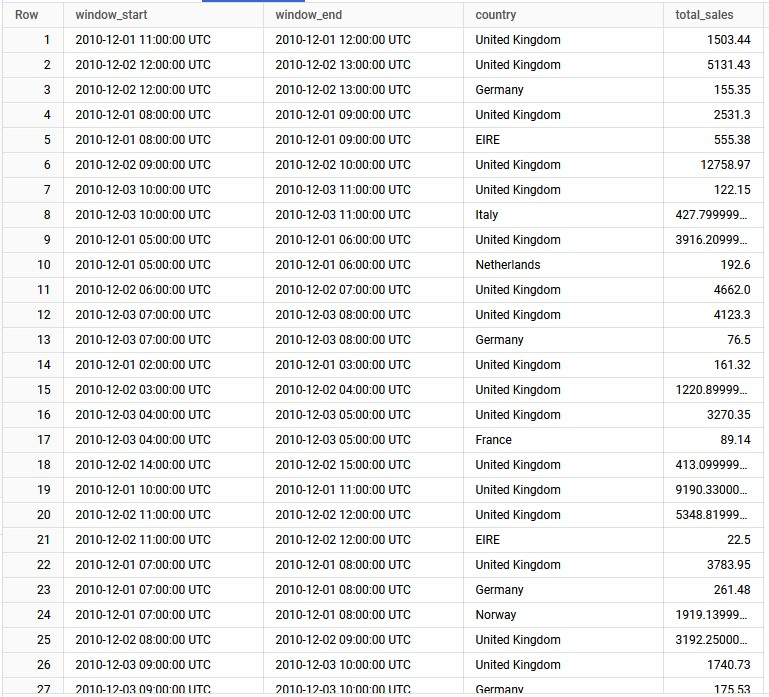

This script is a streaming data processing pipeline built using Apache Beam. It reads online retail data (invoice records), processes it in real-time, and aggregates sales data by country. The processed data is then written to Google BigQuery.

## Overview

The script performs the following key tasks:
1. **Reads Invoice Data**: Simulates messages from Google Pub/Sub containing file details for invoice CSV files stored in Google Cloud Storage (GCS).
2. **Processes Data**: Each CSV file is parsed, and sales data is computed by multiplying the quantity by the unit price.
3. **Aggregates Data**: Sales are aggregated by country within fixed windows of time.
4. **Writes Data to BigQuery**: The aggregated results (total sales per country within a time window) are written to a BigQuery table.

## Components

### 1. **AddTimestampDoFn Class**
   - This class adds a timestamp to each element (invoice record) based on the `InvoiceDate` field.
   - The timestamp is crucial for event-time processing and windowing in the streaming pipeline.
``` python 
class AddTimestampDoFn(beam.DoFn): 
	def process(self, element): 
		yield beam.window.TimestampedValue(element, int(element["InvoiceDate"].timestamp()))
```

### 2. **process_file Function**

- This function is responsible for processing Pub/Sub messages that contain information about CSV files stored in GCS.
- It reads the content of the file from GCS, splits it into rows, and returns the CSV records as dictionaries.

``` python
def process_file(element):
    message = json.loads(element)
    bucket_name = message['bucket']
    file_name = message['name']
    gcs_path = f"gs://{bucket_name}/online_retail_invoice_region_wise/{file_name}"
    gcsio = GcsIO()
    file_content = gcsio.open(gcs_path).read().decode('utf-8')
    yield from csv.DictReader(file_content.splitlines())
```

### 3. **parse_and_filter_csv_row Function**

- This function processes each row of the CSV, cleaning and transforming the data.
- It filters out invalid rows, such as those with negative quantities or missing customer IDs.

``` python
def parse_and_filter_csv_row(element):
    if "," in element["Description"]:
        element["Description"] = " ".join(element["Description"].split(","))
    try:
        if int(element["Quantity"]) < 0 or element["UnitPrice"] == "0.0" or not element["CustomerID"]:
            return None 
        return {
            "InvoiceNo": str(element["InvoiceNo"]),
            "StockCode": str(element["StockCode"]),
            "Description": str(element["Description"]),
            "Quantity": int(element["Quantity"]),
            "InvoiceDate": datetime.strptime(element["InvoiceDate"], '%Y-%m-%d %H:%M:%S'),
            "UnitPrice": float(element["UnitPrice"]),
            "CustomerID": str(int(float(element["CustomerID"]))),
            "Country": str(element["Country"])
        }
    except ValueError:
        return None
```

### 4. **compute_sales Function**

- This function computes the sales for each invoice record by multiplying the `Quantity` by the `UnitPrice`.
- The result is stored as a new field `Sales`

``` python
def compute_sales(element):
    element["Sales"] = round(element["Quantity"] * element["UnitPrice"], 2)
    return element
```

### 5. **prepare_for_bigquery Function**

- This function formats the data for insertion into BigQuery, specifically including the window start and end times, country, and total sales.
- It uses the `window` parameter to extract the time window for the aggregation.

``` python
def prepare_for_bigquery(element, window=beam.DoFn.WindowParam):
    window_start = window.start.to_utc_datetime().strftime('%Y-%m-%d %H:%M:%S')
    window_end = window.end.to_utc_datetime().strftime('%Y-%m-%d %H:%M:%S')
    return {
        "window_start": window_start,
        "window_end": window_end,
        "country": element[0],
        "total_sales": element[1]
    }
```

### 6. **Pipeline Setup**

- The pipeline is created using the `PipelineOptions` class, which configures the options such as project, staging location, and runner.
- The runner is set to `'DirectRunner'` for local execution or `'DataflowRunner'` for running on Google Cloud Dataflow.

``` python
options = PipelineOptions()
google_cloud_options = options.view_as(GoogleCloudOptions)
google_cloud_options.project = 'project-id'  # Replace with your GCP project ID
google_cloud_options.region = 'us-central1'  # Replace with your region
google_cloud_options.temp_location = 'temp-location'  # Replace with your bucket
google_cloud_options.staging_location = 'staging-location'  # Replace with your bucket
options.view_as(beam.options.pipeline_options.StandardOptions).runner = 'DirectRunner'  # Use 'DataflowRunner' for cloud execution
```

### 7. **Pipeline Execution**

- The main pipeline consists of reading mock Pub/Sub messages, processing the files, applying timestamping, windowing, and computing sales.
- Finally, the aggregated sales data is written to BigQuery using the `WriteToBigQuery` transform.

``` python
with beam.Pipeline(options=options) as p:
    input = (
        p
        | 'Mock PubSub Messages' >> beam.Create([ ... ])  # Simulated Pub/Sub messages
        | 'Process Files' >> beam.FlatMap(process_file)
        | 'Parse the Data Type' >> beam.Map(parse_and_filter_csv_row)
        | 'Filter Valid Rows' >> beam.Filter(lambda x: x is not None)
        | "Add Timestamps" >> beam.ParDo(AddTimestampDoFn())
        | "Apply Fixed Window" >> beam.WindowInto(beam.window.FixedWindows(3600))
        | 'Compute Sales' >> beam.Map(compute_sales)
    )

    country_sales = (
        input
        | "Key By Country" >> beam.Map(lambda record: (record["Country"], record["Sales"]))
        | "Aggregate Sales by Country" >> beam.CombinePerKey(sum)
        | "Prepare for BigQuery" >> beam.Map(prepare_for_bigquery)
        | 'Write to BigQuery' >> WriteToBigQuery(
            table='kinetic-guild-441706-k8:sales_analysis.country_sales_summary',
            schema={
                "fields": [
                    {"name": "window_start", "type": "TIMESTAMP", "mode": "REQUIRED"},
                    {"name": "window_end", "type": "TIMESTAMP", "mode": "REQUIRED"},
                    {"name": "country", "type": "STRING", "mode": "REQUIRED"},
                    {"name": "total_sales", "type": "FLOAT", "mode": "REQUIRED"}
                ]
            },
            write_disposition=BigQueryDisposition.WRITE_APPEND,
            create_disposition=BigQueryDisposition.CREATE_IF_NEEDED
        )
    )
```

### Key Concepts

- **Windowing**: The data is processed in fixed time windows (e.g., 1 hour) to group records by time.
- **Event Time Processing**: The pipeline uses event timestamps (`InvoiceDate`) to ensure accurate processing of out-of-order data.
- **Aggregation**: Sales data is aggregated by country using a combination of `CombinePerKey` and summing the sales.
- **BigQuery Integration**: The aggregated data is written to BigQuery, a fully-managed data warehouse, for further analysis.

## Running the Pipeline

To run the pipeline, ensure that Apache Beam is installed and that you have configured your Google Cloud project and BigQuery dataset. For local execution, use `DirectRunner`, and for cloud execution, use `DataflowRunner` with appropriate configurations.

``` bash
python streaming_file_processor.py
```

## Result


This pipeline serves as an example of how to process streaming data using Apache Beam and Google Cloud services, allowing you to aggregate and analyze sales data in near-real-time.

``` vbnet
This markdown document provides an in-depth explanation of the script, its components, and how the pipeline works to process and aggregate the sales data for analysis in BigQuery.
```


